# Exam Environment Explanation

Below contains some extra information about how to submit your answers and open VSCode within the Exam Environment.

- [Exam Environment Explanation](#exam-environment-explanation)
- [Opening the Exam Environment](#opening-the-exam-environment)
- [Help! I need my original files back](#help-i-need-my-original-files-back)
  - [Submission: Section 1 - Multiple Choice](#submission-section-1---multiple-choice)
  - [Submission: Section 2 - Short Answer](#submission-section-2---short-answer)
  - [Submission: Section 3 - Design \& Programming](#submission-section-3---design--programming)
    - [Section 3 - VSCode Debugging](#section-3---vscode-debugging)
    - [Section 3 - VSCode Quick Fix](#section-3---vscode-quick-fix)

# Opening the Exam Environment

Upon opening the exam, you will be presented with the exam specification document open in a browser.

To open a terminal, navigate to the bottom left of your screen and click the `>` button:

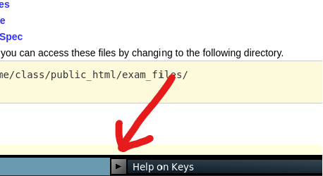

This will open up a dropdown where you can select an `XTerm` terminal to be opened. There are some variations of this, but they all have the same functionality.

Using `ls -l` you can list all the contents in your exam directory. It should follow the structure of the following:

```
.
├── exam-master
│   ├── app
│   │   ├── build.gradle
│   │   ├── lib
│   │   └── src
│   │       ├── main
│   │       └── test
│   ├── gradle
│   ├── q14.txt
│   ├── q15.txt
│   ├── q16.txt
│   ├── q17.txt
│   ├── q18.txt
│   ├── q19.txt
│   └── settings.gradle
└── submitted
```

Key files and folders:

- `exam-master`: This is the main folder you should be working in for **section 2 and 3** of the exam. To re-open this folder in VSCode, run `code ~/exam-master`.
- `exam-master/q*.txt`: The text files are for **section 2 only**. You can edit these files in VSCode then submit them following the instructions on the paper.
- `submitted`: A folder **generated after your first submission** that contains the answers you have submitted. Do not modify. See more info below.

# Help! I need my original files back

If you require a clean original copy of the exam files, you can use the `fetch <file_name_with_extension>` command. This will copy the original file into the `~/exam-master` directory.

For example, you wanted to fetch the original copy of `ExamSystemController.java`, you would run the following command:

```bash
fetch ExamSystemController.java
```

This will copy the original file into the `~/exam-master` directory.

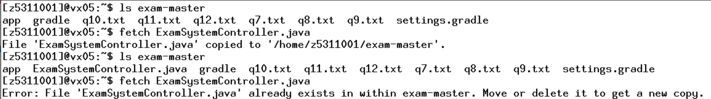

Note: If the file already exists within `~/exam-master` you must delete/remove it to get a new copy.

## Submission: Section 1 - Multiple Choice

To submit your answers for section 1, you will need to use the `submit` command in the terminal. The full command is specified under each question.

For example, if you want to submit your answer for Question 1, you would run the following command `submit mc 1`. This will bring up a prompt asking for your answer:

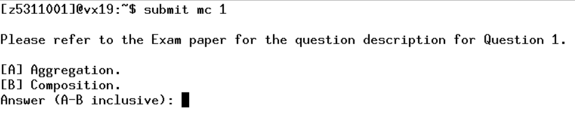

You must type in a valid answer and hit enter on your keyboard. After doing so, an output of your answer will be printed to the terminal to confirm:

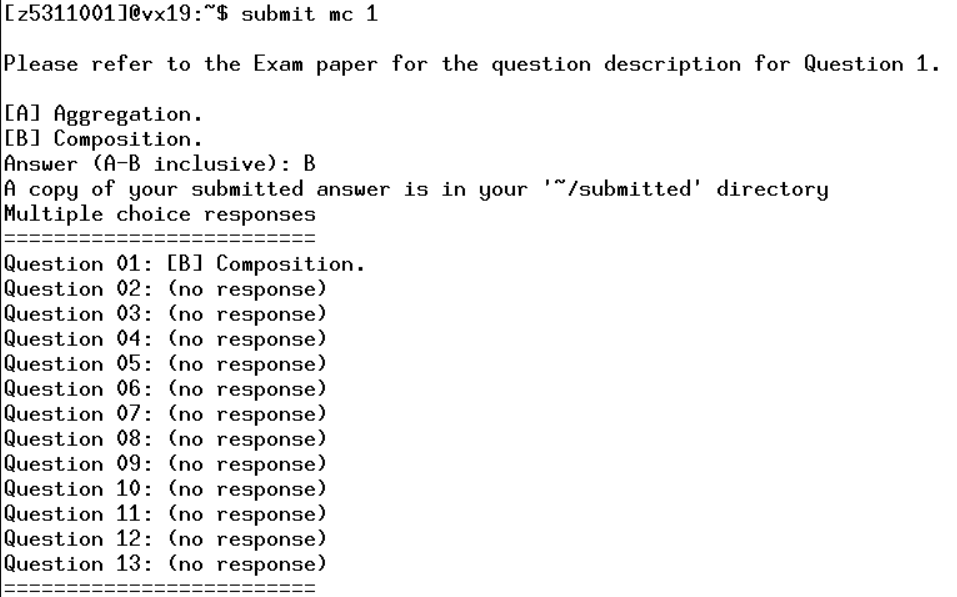

## Submission: Section 2 - Short Answer

> To write your answer, you can open the respective text (`.txt`) file using VSCode. For example, if you were working on Question 14, you can do this by running the following commands:
>
> ```bash
> code ~/exam-master/q14.txt
> ```

After you have written your response, **make sure you save the file.**

> VSCode provides an indicator if a file has unsaved changes. See the images below:
>
> 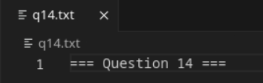
>
> Note the 'X' symbol next to the file name `q14.txt`. This indicates that the file has been saved and has no unsaved changes. **You should only submit when you see this.**
>
> 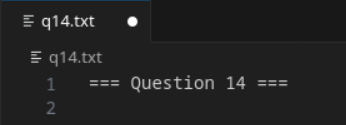
>
> Note the `*` (or circle) symbol next to the file name `q14.txt`. This indicates that the file has unsaved changes. **You should save the file before running the submit command**.

Then follow the instructions and run the submission command. For example, if you wanted to submit Question 14, you would run the command: `submit q14`. You should also see the following output after:

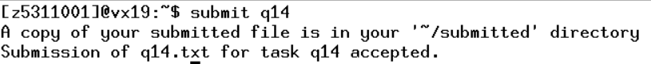

You can view a copy of what you have submitted by running the following command:

```bash
cat ~/submitted/q14.txt
```

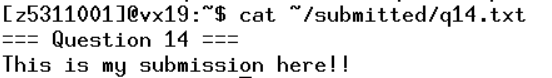

> Note: Do not modify any files within the `~/submitted` directory. If you want to make changes to your answer, edit the corresponding `.txt` file and re-run the submission command.

## Submission: Section 3 - Design & Programming

> To get started, ensure you have opened VSCode within the `exam-master` directory. **This is extremely important in order for Gradle, Java, and VSCode to work together**. You can run the following command to ensure you open vscode correctly: `code ~/exam-master`
>
> VSCode also indicates which folder you have open in the top left of the editor. See the red arrow in the image below:
>
> 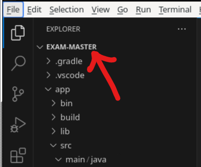
>
> If it does not say `exam-master` where the red arrow is pointing, then you have opened VSCode in the wrong directory. Try the command again.

After completing the question, follow the instructions and run the submission command. For example if you wanted to submit Question 20, you would run hte command `submit q20`. You should see the following output after:

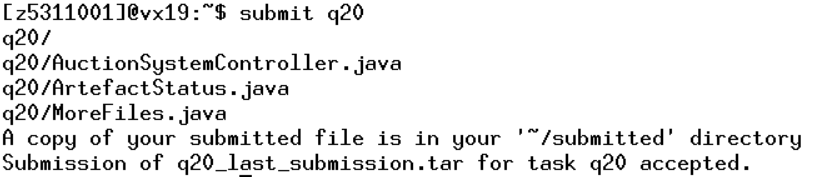

> Note: Do not modify any files within the `~/submitted` directory. If you want to make changes to your answer, edit the corresponding `.txt` file and re-run the submission command.

### Section 3 - VSCode Debugging

If you suffer any issues with VSCode, you should always

1. Make sure you have `exam-master` open in VSCode. See the [instructions above](submission-section-3---design--programming).
2. Try and clear the java environment. See below for instructions.

> Open up the command palette using `control + shift + p` and search for `java clean` then hit enter & restart VSCode.
>
> 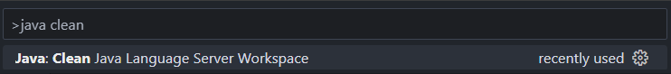

3. Ask your invigilator for help.

### Section 3 - VSCode Quick Fix

If you are trying to use VSCode's Quick-Fix feature, you will not be able to click on it.

Instead, hover over the error and press `control + .` to bring up the quick fix menu.

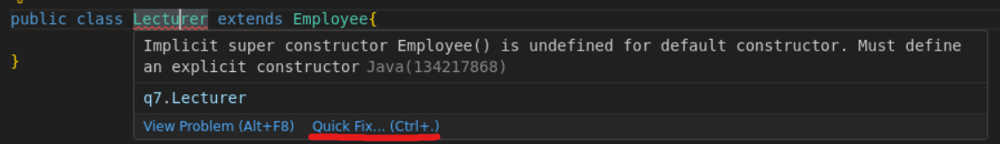
