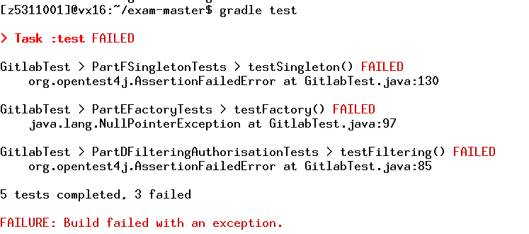
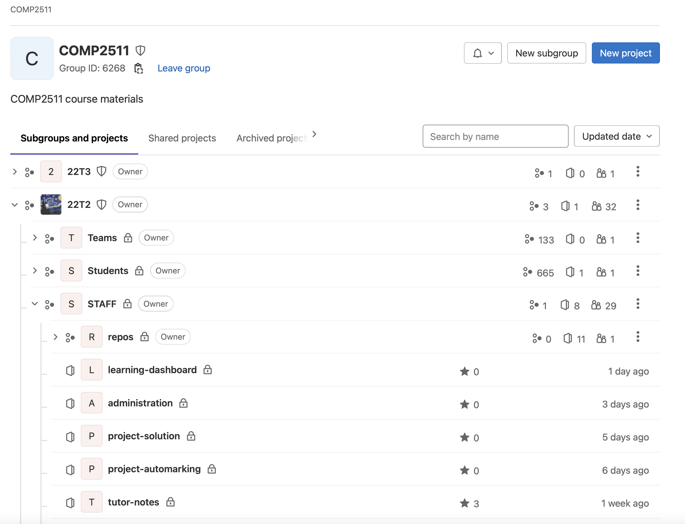

# Sample Final Exam <!-- omit in toc -->

Answers all of the questions.

> Please note the purpose of the sample exam is to get you familiar with the layout and the exam environment.
>
> It is **not representative of the topics that will be covered in the final exam, or the difficulty of the final exam.**
>
> If you have any questions about how the exam environment works, you should ask your tutor now.

- [Exam Environment Explanation](#exam-environment-explanation)
- [Part 1: Multiple Choice (25 Marks)](#part-1-multiple-choice-25-marks)
  - [Question 1 (2 marks)](#question-1-2-marks)
  - [Question 2 (2 marks)](#question-2-2-marks)
  - [Question 3 (2 marks)](#question-3-2-marks)
  - [Question 4 (2 marks)](#question-4-2-marks)
  - [Question 5 (2 marks)](#question-5-2-marks)
  - [Question 6 (2 marks)](#question-6-2-marks)
  - [And more questions...](#and-more-questions)
- [Part 2: Short Answer (25 Marks)](#part-2-short-answer-25-marks)
  - [Question 7 (2 marks)](#question-7-2-marks)
  - [Question 8 (4 marks)](#question-8-4-marks)
  - [Question 9 (2 marks)](#question-9-2-marks)
  - [Question 10 (5 marks)](#question-10-5-marks)
  - [Question 11 (3 marks)](#question-11-3-marks)
  - [Question 12 (3 marks)](#question-12-3-marks)
  - [And more questions...](#and-more-questions-1)
- [Part 3: Design \& Programming (50 marks)](#part-3-design--programming-50-marks)
  - [Question 13 (10 Marks)](#question-13-10-marks)
  - [Question 14 (35 marks)](#question-14-35-marks)
    - [a) Code Analysis (5 Marks)](#a-code-analysis-5-marks)
    - [b) Refactoring a Method (3 marks)](#b-refactoring-a-method-3-marks)
    - [c) Refactoring the Design (9 marks)](#c-refactoring-the-design-9-marks)
    - [d) Filtering Authorisation (9 marks)](#d-filtering-authorisation-9-marks)
    - [e) Factory Pattern (9 marks)](#e-factory-pattern-9-marks)
    - [f) \[EXTRA\] Singleton Pattern (9 marks)](#f-extra-singleton-pattern-9-marks)
  - [Question 15 (20 Marks)](#question-15-20-marks)
    - [a) Code Smells (2 marks)](#a-code-smells-2-marks)
    - [b) Refactoring a Method (3 marks)](#b-refactoring-a-method-3-marks-1)
    - [c) Refactoring the Design (6 marks)](#c-refactoring-the-design-6-marks)
    - [d) Confluence Spaces (9 marks)](#d-confluence-spaces-9-marks)
    - [e) Bonus: Space Iterator (5 marks)](#e-bonus-space-iterator-5-marks)
  - [And more questions...](#and-more-questions-2)
- [End of Exam](#end-of-exam)

The following files (lecture slides and lecture demo code from the relevant lectures) are available during the exam. You can use them to develop your solutions; please cite them. You can access these files by changing to the following directory.

```bash
$ cd /home/class/public_html/exam_files/
$ ls -l
```

# Exam Environment Explanation

<h1 style="color: red; font-size: 46px; text-decoration: underline;"><a href="./ExamEnvironmentExplanation.md target="_blank">Please read this before continuing</a></h1>

# Part 1: Multiple Choice (25 Marks)

## Question 1 (2 marks)

On a bike, there are one or more tyres.

The following relationship is an example of:

- A) Aggregation
- B) Composition
- C) Neither

 [Ans:A)]

**Submit your answer using the following command:**

### `submit mc 1` <!-- omit in toc -->

## Question 2 (2 marks)

Consider the following lambda function which prints log. The type signature has been redacted.

`[redacted] logger = log -> System.out.println(log);`

Pick the most semantically correct type from the list below:

- A) `Function<String, Boolean>`
- B) `Consumer<String>`
- C) `Predicate<String>`
- D) `Supplier<String>`

**Submit your answer using the following command:**

[Ans:B)]

### `submit mc 2` <!-- omit in toc -->

## Question 3 (2 marks)

Which design pattern is most appropriate for the following scenario.

You have a program that needs to print error messages from multiple methods. All such error messages must be sent to the file called “error.txt”.

- A) Factory
- B) Strategy
- C) Singleton
- D) Visitor
- E) Adaptor

**Submit your answer using the following command:**

[Ans:C)]

### `submit mc 3` <!-- omit in toc -->

## Question 4 (2 marks)

Which of the following would be a valid use case for instanceof instead of getClass for checking the type of an object?

- A) Checking if an object complies with an interface so that we can use a method on that interface
- B) Implementing the equals method for an object
- C) It’s a trick question, you should never use instanceof in your code at all

**Submit your answer using the following command:**

[Ans:A]

### `submit mc 4` <!-- omit in toc -->

## Question 5 (2 marks)

The following is taken from a student’s Assignment II blog.

> In Assignment II, after I completed Part 1 and refactored the code, I started work on Part 2 but found I had to go and modify everything because the design didn’t work with the new requirements.

Which SOLID principle is being violated? Select the most suitable answer.

- A) Single Responsibility Principle
- B) Open-Closed Principle
- C) Liskov Substitution Principle
- D) Interface Segregation Principle
- E) Dependency Inversion Principle

**Submit your answer using the following command:**

[Ans:B)]

### `submit mc 5` <!-- omit in toc -->

## Question 6 (2 marks)

Which design patterns are particularly focused on inter-object communication?

- A) Creational Patterns
- B) Structural Patterns
- C) Behavioural Patterns
- D) All of the Above

**Submit your answer using the following command:**

### `submit mc 6` <!-- omit in toc -->

[Ans:C]

## And more questions...

# Part 2: Short Answer (25 Marks)

## Question 7 (2 marks)

Is the following an example of aggregation or composition? Explain why.

> An online call contains breakout rooms.

Write your answer inside `q7.txt`.

**Submit your answer using the following command:**

[Q7Ans:This is an example of composition. A breakout room cannot exist outside of a call. When the call ends, all contained breakrooms must end as well.]

### `submit q7` <!-- omit in toc -->

## Question 8 (4 marks)

Consider the following code:

```java
public class Student {
    /**
     * Schedules a student's class for a specific time.
     * @preconditions - Start and end are between 9am and 5pm, start < end
     * @postconditions - If there is an available class at that time, the class is scheduled
     *                 - If there is no available class at that time, the nearest class outside those times is scheduled
     */
    public void scheduleClass(LocalTime start, LocalTime end) {
    }
}

public class UNSWStudent extends Student {
    /**
     * Schedules a UNSW-timetabled class for a specific time.
     * @preconditions - Start and end are between 9am and 9pm, start < end
     * @postconditions - If there is an available class at that time, the class is scheduled
     *                 - If there is no available class at that time, nothing happens
     */
    public void scheduleClass(LocalTime start, LocalTime end) throws UnsuccessfulSchedulingException {
    }
}
```

Is this valid inheritance? Conceptually justify your answer.

Write your answer inside `q8.txt`.

[Q8ans:This is not a valid inheritance, as it violates the Liskov Substitution Principal (LSP). The issue here is that the UNSWStudent class violates the postconditions of scheduleClass method that are imposed by the Student class. When a Student schedules a class that is not available, it schedules the nearest class outside of the requested times. In contrast, a UNSWStudent does not schedule any class when this occurs. The subclass UNSWStudent is increasing the number of possible outcomes that occur in the post conditions. This means UNSWStudent cannot be substituted for a Student (as required by LSP), and therefore this is not a valid inheritance.
Another issue is that the subclass throws an additional exception that the parent class does not declare. This also increases the number of possible outcomes in the parent class and constitutes a weakening of the postconditions, thereby violating LSP.
(Either one of the two above reasons would be enough) ]

**Submit your answer using the following command:**

### `submit q8` <!-- omit in toc -->

## Question 9 (2 marks)

Consider the generic Stack class from Tute 08, where we have modified the type signature to be the following:

```java
public class Stack<E extends Collection<E>> implements Iterable<E>
```

When we try to declare a new stack of strings, we are now given a compilation error:

```java
Stack<String> stack = new Stack<String>();
// Bound mismatch: The type String is not a valid substitute for
// the bounded parameter <E extends Collection<E>> of the type Stack<E>
```

Explain why this error occurs.

Write your answer inside `q9.txt`.

**Submit your answer using the following command:**

[Q9Ans: String does not implement the Collection interface. Therefore, String does not satisfy the generic bounds E extends Collection. This means that Stack is invalid, as Stack does not satisfy Stack<E extends Collection>.]

### `submit q9` <!-- omit in toc -->

## Question 10 (5 marks)

The following question relates to Assignment I: Back in Blackout.

A student submitted the following code for their getInfo method in the BlackoutController.

```java
public EntityInfoResponse getInfo(String id) {
    EntityInfoResponse eir = null;
    for (Device device: deviceList) {
        if (device.getId() == id) {
            if (device.getClass() == HandheldDevice.class) {
                eir = new EntityInfoResponse(device.getId(), device.getPosition(), 69911, "HandheldDevice",
                  device.getFiles());
            } else if (device.getClass() == LaptopDevice.class) {
                eir = new EntityInfoResponse(device.getId(), device.getPosition(), 69911, "LaptopDevice",
                  device.getFiles());
            } else if (device.getClass() == DesktopDevice.class) {
                eir = new EntityInfoResponse(device.getId(), device.getPosition(), 69911, "DesktopDevice",
                  device.getFiles());
            }
        }
    }
    for (Satellite satellite: satelliteList) {
        if (satellite.getId() == id) {
            if (satellite.getClass() == StandardSatellite.class) {
                eir = new EntityInfoResponse(satellite.getId(), satellite.getPosition(), satellite.getHeight(), "StandardSatellite",
                  satellite.getFiles());
            } else if (satellite.getClass() == TeleportingSatellite.class) {
                eir = new EntityInfoResponse(satellite.getId(), satellite.getPosition(), satellite.getHeight(), "TeleportingSatellite",
                  satellite.getFiles());
            } else if (satellite.getClass() == RelaySatellite.class) {
                eir = new EntityInfoResponse(satellite.getId(), satellite.getPosition(), satellite.getHeight(), "RelaySatellite",
                  satellite.getFiles());
            }
        }
    }
    return eir;
}
```

Identify **two code smells** present in the above code, and explain how you would resolve the smells.

Write your answer inside `q10.txt`.

**Submit your answer using the following command:**

[Q10Ans: Two code smells that are present in the above code is duplicated code and switch/if statements. (Other potential code smells present is inappropriate intimacy or feature envy.) A potential fix for the codebase is to move the logic inside each of the individual Satellite/Device classes so that the logic is in one place. The differences in implementation between each of the cases can be moved into an abstract class (or, in cases such as the type, put it as an attribute in the parent class). That way, we can reduce the entirety of this section of code in this location to entity.getInfo(); while letting polymorphism determine the differences between the implementations.]

### `submit q10` <!-- omit in toc -->

## Question 11 (3 marks)

```java
class Animal {
    public String noise() {
        return "I make a noise";
    }
}
class Dog extends Animal {
    @Override
    public String noise() {
        return "Woof woof";
    }
}
class App {
    public static void main(String[] args) {
        Dog dog = new Dog();
        Animal animal = dog;
        System.out.println(animal.noise());
    }
}
```

What will the above program print? With reference to concepts surrounding dynamic polymorphism, explain your answer.

Write your answer inside `q11.txt`.

**Submit your answer using the following command:**

[Q11Ans: The above program will print Woof woof!. This is due to the way dynamic polymorphism works. Dynamic polymorphism ensures that when you run a method on an object, the implementation that gets run depends on the runtime type (i.e. the type the object was instantiated as) rather than the compile-time time. In this case, even though the compile-time type of animal is the Animal class, the runtime type is Dog so the implementation of noise() that will be run is the overridden method inside the Dog class.]

### `submit q11` <!-- omit in toc -->

## Question 12 (3 marks)

A user bought an application that reads data in JSON format, and displays results on a web page. Later, the user realised that one of their data sources is in XML format. Unfortunately, the user does not have access to the source code of the application, so it is not possible to change the application.

Give the most appropriate design pattern for this situation. In answering, justify your choice by describing the mapping of this domain to the key characteristics of your chosen Design Pattern.

Write your answer inside `q12.txt`.

**Submit your answer using the following command:**

### `submit q12` <!-- omit in toc -->

[Q12Ans:The adapter pattern is the most appropriate design pattern in this situation. The adapter pattern can 'adapt' the program outputting XML format into JSON format so that the application can read the data. A key characteristic in the adapter pattern is making two incompatible systems by adding an intermediary class in-between them. In this case, adding a class that would adapts the original application so that it outputs in JSON instead of XML would help this problem. Another part of the adapter pattern is that the original classes or codebases are impossible or hard to change to make compatible, which is present here.]

## And more questions...

# Part 3: Design & Programming (50 marks)

> Your code for every part of this section needs to compile. **This includes Question 13**. If your code fails to compile, since everything is in the same directory, the gradle build will fail and none of the automarking will run.
>
> To check whether your code compiles, run `gradle test`. You don't need to pass all of the tests, they just need to run. See an example below.
>
> 

> You need to be inside the `exam-master` folder for VScode to configure itself properly.
>
> Open a terminal and run `code ~/exam-master`

## Question 13 (10 Marks)

With a return to in-person exams, CSE has decided to build a system that will allow for exams to be administered. The system has the following functional requirements:

- An exam has a series of centres allocated to it, for example J17 Ainsworth, K17 CSE, etc.
- Each centre has one or more classrooms, for example Bongo, Lyre, Viola.
- Each centre has a supervisor, which is a staff member;
- Each classroom has an invigilator, which is also a staff member, as well as a maximum capacity;
- Students can be added to classrooms or removed from classrooms;

Model the domain for the above requirements to form the basis of a potential software solution. Your answer should include:

- Interfaces, if applicable
- Class Signatures, including inheritance relationships where appropriate
- Method Signatures
- Key Fields and relationships, including aggregations, compositions and cardinalities between entities (written as comments)

**You do not need to implement any of these classes/methods, you are simply providing the prototypes / stubs**. Any design decisions that you feel need justifying you can do so as a comment / JavaDoc in the respective Java file.

**Do not draw a UML diagram for this question.**

An interface for the entire system has been provided to you in `app/src/main/java/q13/ExamSystemController.java`. You can modify these method prototypes if you like, though you shouldn't need to.

There is a _lot_ of undefined behaviour about this system, which is intentional. You can make as many assumptions as you need, so long as they don't reduce the scope of the specification.

You will be assessed on:

- Modelling of Entities (4 marks)
- Aggregations, Compositions and Cardinalities (3 marks)
- Modelling of Functionality (3 marks)

**Submit your answer using the following command:**

### `submit q13` <!-- omit in toc -->

## Question 14 (35 marks)

In Gitlab, there are two types of "nodes" in a structural tree of permissions and access - **groups** and **projects**.

- **Groups** are nodes that can contain projects, or other subgroups;
- **Projects** are nodes that do not have any subgroups or subprojects, and act as a code repository



In the above example, the tree consists of the COMP2511 group which contains the 22T2 group, which contains STAFF group which contains the tutor-notes project, other projects and another group called repos.

At each level, a user can have one of four different types of **permissions**:

- Owner
- Maintainer
- Developer
- Reporter

For the purposes of this question, the only actions that will require permissions are:

- Creating a project, which requires Developer permissions
- Creating a subgroup, which requires Maintainer permissions
- Changing the permissions of another member in the group, which requires Owner Permissions

Inside `src/main/java/q14` we have implemented a very basic system that addresses the above requirements. In this question you will be required to **analyse the existing code, make notes of design smells and refactor the code, and adapt the code to an evolution in the requirements.**

There are a series of regression tests that currently pass on the code in `RegressionsTests` within `GitlabTest.java`.

### a) Code Analysis (5 Marks)

Look at the code inside the `q14` package and in `q14.txt` answer the following questions:

1. Explain what Design Pattern is being used to represent the system, and how the domain relates to the key characteristics of the pattern. (2 marks)
2. Identify what you think is the main design problem present in the existing code, including what smells are indicating the problem. (2 marks)
3. Which of the following design smells is also present in the code? (1 mark)

- Divergent Change
- Inappropriate Intimacy
- Refused Bequest
- Message Chains

### b) Refactoring a Method (3 marks)

Refactor the following method inside `GitlabGroup` to use streams:

```java
public List<String> getUsersOfPermissionLevel(PermissionsLevel level) {
    Set<User> membersSet = members.keySet();
    List<String> names = new ArrayList<String>();

    for (User member : membersSet) {
        if (members.get(member).equals(level)) {
            names.add(member.getName());
        }
    }

    return names;
}
```

In your refactoring, you will need to keep the regression tests passing, which are provided in `RegressionsTests` within `GitlabTest.java`.

### c) Refactoring the Design (9 marks)

Based on your notes on Design Smells from Part A, refactor the design of the system accordingly.

You can make any changes as you like, so long as you keep the regression tests passing, which are provided in `RegressionsTests` within `GitlabTest.java`.

Any notes you wish to make regarding your refactoring can go inside `q14.txt`.

The mark breakdown for this question is as follows:

- Maintaining Correctness (1 mark)
- Refactoring (8 marks)

### d) Filtering Authorisation (9 marks)

Currently, there is a major flaw in our implementation - the system does not **filter** permissions from groups to all their subgroups and projects.

For example, if Claire is the owner of the COMP2511 group, then she is also the owner of the 22T2 group, the STAFF group and the tutor-notes project and has the same Owner permissions on those groups as if she was a direct owner of those respective nodes.

Similarly, if a user tries to give permissions to another user in a group which, by filtering authorisation they **already** have permissions on, a `GitlabAuthorisationException` should be thrown.

In code, here is an illustration of the above description:

```java
User user = new User("Claire");
User user2 = new User("Eddie");

// Create a group
GitlabPermissionsNode group = new GitlabGroup("COMP2511", user);
// Create a subgroup
GitlabPermissionsNode group2 = assertDoesNotThrow(() -> group.createSubgroup("22T2", user));
// Give dev access to Eddie on the COMP2511 group
assertDoesNotThrow(() -> group.updateUserPermissions(user2, PermissionsLevel.DEVELOPER, user));
// Check that Eddie also has dev access on the 22T2 group
assertEquals(PermissionsLevel.DEVELOPER, group2.getUserPermissions(user2));
// Try to give Eddie reporter access on the 22T2 group, but he is already a developer of COMP2511
// so an authorisation error is thrown
assertThrows(GitlabAuthorisationException.class,
    () -> group2.updateUserPermissions(user2, PermissionsLevel.REPORTER, user));
```

Implement the 'filtering' of authorisation. A basic test has been provided to you in `PartDFilteringAuthorisationTests` within `GitlabTest.java`. We will run further tests on this question to assess the correctness of your solution.

The mark breakdown for this question is as follows:

- Correctness (5 marks)
- Design (4 marks)

Any notes you wish to make regarding your design can go inside `q14.txt`.

### e) Factory Pattern (9 marks)

Inside `GitlabFactory.java`, implement the following method:

```java
public static GitlabPermissionsNode gitlabFromJson(String jsonString, User user)
```

The `gitlabFromJson` method should take in a string of the following format:

```json
{
  "type": "group",
  "name": "COMP2511",
  "subgroups": [
    {
      "type": "group",
      "name": "22T2",
      "subgroups": [
        {
          "type": "project",
          "name": "dungeonmania"
        }
      ]
    },
    {
      "type": "project",
      "name": "blackout"
    }
  ]
}
```

and produce a `GitlabPermissionsNode` with the corresponding structure. You do not need to handle any processing of group/project members in this part of the question.

A basic test has been provided to you in `PartEFactoryTests` within `GitlabTest.java`. We will run further tests on this question to assess the correctness of your solution.

Any notes you wish to make regarding your design can go inside `q14.txt`.

The mark breakdown for this question is as follows:

- Correctness (5 marks)
- Design (4 marks)

**Submit your answer using the following command:**

### `submit q14` <!-- omit in toc -->

### f) [EXTRA] Singleton Pattern (9 marks)

> This is an alternative question to [task e)](#e-factory-pattern-9-marks)

All projects in Gitlab run their pipelines on a single machine, which is why the runner gets very slow around project and assignment deadlines.

Currently, the `runPipeline` method inside `GitlabProject`, which takes in an runnable "process" creates a new instance of the runner and runs the job.

```java
public void runPipeline(Runnable job) {
    GitlabRunner runner = new GitlabRunner();
    runner.run(job);
}
```

Refactor the code to use the **Singleton Pattern** so that only one instance of the `GitlabRunner` exists and only one job is able to run at a time (i.e. only one `run` call can be made at a time).

A basic test has been provided to you in `PartFSingletonTests` within `GitlabTest.java`. We will run further tests on this question to assess the correctness of your solution.

Any notes you wish to make regarding your design can go inside `q14.txt`.

The mark breakdown for this question is as follows:

- Correctness (5 marks)
- Design (4 marks)

**Submit your answer using the following command:**

### `submit q14` <!-- omit in toc -->

## Question 15 (20 Marks)

In this question, you will be refactoring an existing system that functions as a simplified version of Confluence.

This system allows for the creation of **Confluence Page** objects, which are interacted with by Authors who contribute to the page. At any time, a page has one of four statuses:

- **Editing** - the document is currently being edited, where authors can write the content in the document
- **Viewing** - the document draft is currently being viewed, where the author can see information such as the number of - characters;
- **Publishing** - the document draft is being finalised, where the author can give the document a title; and
- **Published** - the document is now fully published, and the author can see the full document as well as all of the contributors to the document.

Inside `app/src/main/java/q15/confluence` we have implemented a very basic system that addresses the above requirements. You will be required to **analyse the existing code, make notes of design smells and refactor the code**, and **adapt the code to an evolution in the requirements**.

There are a series of regression tests that currently pass on the code in `RegressionTests` within `ConfluenceTest.java`.

### a) Code Smells (2 marks)

Identify the main design problem present inside `ConfluencePage.java`, including what smells are indicating the problem. You will be addressing this problem in Part C of the question.

Write your answer inside `q15.txt`.

### b) Refactoring a Method (3 marks)

Refactor the following method inside `ConfluencePage.java` to use streams.

```java
private String getContributors() {
    String contributors = "";
    for (ConfluenceAuthor contributor : this.contributors) {
        contributors += contributor.getName() + ", ";
    }
    contributors = contributors.substring(0, contributors.length() - 2);
    return contributors;
}
```

### c) Refactoring the Design (6 marks)

i) Identify a suitable Design Pattern to resolve the design problem you identified in Part A. Justify your choice by explaining the how the scenario maps to the **key characteristics** of your chosen Design Pattern. Write your answer inside `q15.txt`.

ii) Implement your selected Design Pattern to refactor the code inside `ConfluencePage.java`.

You can make any changes as you like, so long as you keep the regression tests passing unchanged, which are provided in `RegressionTests` within `ConfluenceTest.java`.

Any notes you wish to make regarding your refactoring can go inside `q15.txt`.

### d) Confluence Spaces (9 marks)

A **Space** in Confluence can hold multiple pages, as well as other spaces. In the following example, the COMP2511 space contains the Course Outline page and the Course Philosophy page, as well as the 23T1 space which in turn contains the Exam Spec page.


Spaces also provide the functionality of being able to determine the number of subpages the space contains. In the above example, the number of subpages in the 23T1 space is 1, and the number of subpages in the COMP2511 space is 3.

You have been provided with a `ConfluenceSpace` class to get you started. You will need to implement the methods

- `getNumPages`
- `addSubnode`

and modify any other files in the package as needed.

i. Identify a suitable Design Pattern to help you implement this evolution in the requirements. Justify your choice by mapping the how the scenario maps to the **key characteristics** of your chosen Design Pattern. Write your answer inside `q15.txt`. (2 marks)

ii. Using your selected Design Pattern, implement the new functionality. (7 marks)

A basic test has been provided to you in `PartDConfluenceSpaceTest` within `ConfluenceTest.java`. We will run further tests on this question to assess the correctness of your solution.

Any other notes you wish to make regarding your design can go inside `q15.txt`.

**Submit your answer using the following command:**

### `submit q14` <!-- omit in toc -->

### e) Bonus: Space Iterator (5 marks)

As part of another new feature where users can view Confluence Pages in a streamed “Tik Tok” style for a given space, you will need to implement an iterator for a Confluence space, which iterates through each page in the space.

To understand this iterator, let’s have a look at the provided test case on a Confluence space which has a similar structure to the diagram in Part d).

```java
 @Test
public void testIterator() {
    ConfluenceSpace spaceComp2511 = new ConfluenceSpace();
    ConfluenceSpace space22t3 = new ConfluenceSpace();

    ConfluencePage courseOutline = new ConfluencePage();
    ConfluencePage coursePhilosophy = new ConfluencePage();
    ConfluencePage examSpec = new ConfluencePage();
    ConfluencePage examSuppSpec = new ConfluencePage();

    spaceComp2511.addSubnode(courseOutline);
    spaceComp2511.addSubnode(coursePhilosophy);
    spaceComp2511.addSubnode(space22t3);
    space22t3.addSubnode(examSpec);
    space22t3.addSubnode(examSuppSpec);

    Iterator<ConfluencePage> iter = spaceComp2511.iterator();

    assertEquals(courseOutline, iter.next());
    assertEquals(coursePhilosophy, iter.next());
    assertEquals(examSpec, iter.next());
    assertEquals(examSuppSpec, iter.next());
    assertFalse(iter.hasNext());
}
```

The first page visited is the course outline, since it was added to the top-level space first. Then the course philosophy page is visited, since it was added second. Then, the 23T1 space is visited with each of its pages. In the 23T1 space, the exam spec is returned, followed by the sump exam spec.

Traversal through the tree is depth-first in the order that the subnodes were added to the tree.

Implement the method `iterator` in `ConfluenceSpace.java` according to this specification. The above test is provided for you inside `PartEIteratorTest`.

**Submit your answer using the following command:**

### `submit q15` <!-- omit in toc -->

## And more questions...

# End of Exam
